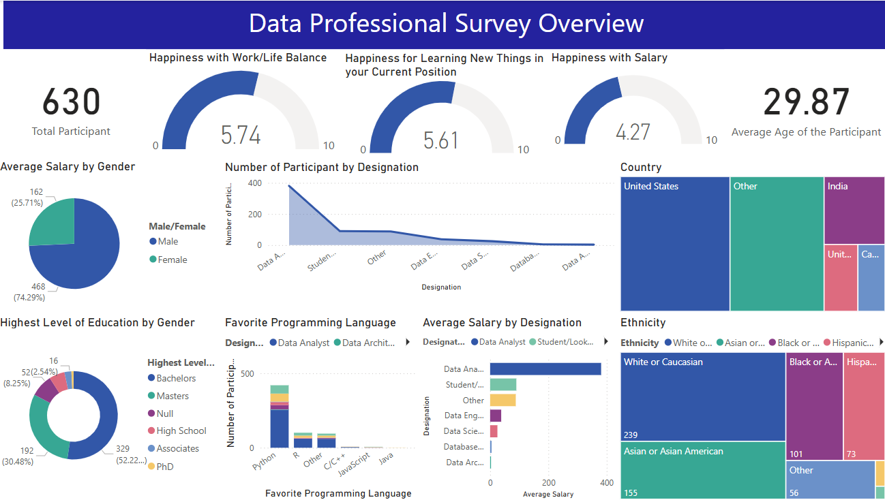

# Data Professional Survey - Power BI Dashboard

## Overview
This repository contains a comprehensive Power BI dashboard analyzing survey data from 630 data professionals. The dashboard provides insights into demographics, salaries, work satisfaction, and career preferences within the data industry.




## 📊 Dashboard Highlights

### Key Metrics
- **630 Total Participants**
- **Average Age: 29.87 years**
- **Gender Distribution**: 74.29% Male, 25.71% Female
- **Geographic Reach**: Primarily US-based with international representation

### Satisfaction Scores (0-10 scale)
- **Work/Life Balance**: 5.74/10
- **Learning Opportunities**: 5.61/10
- **Current Salary**: 4.27/10

## 🎯 Key Insights

### Demographics
- **Education**: 52.22% hold Bachelor's degrees, 30.48% have Master's degrees
- **Geographic Distribution**: Majority from United States, with significant representation from India, Canada, and other countries
- **Ethnicity**: Diverse workforce with White/Caucasian (239), Asian/Asian American (165), Black/African American (101), and Hispanic/Latino (73) participants

### Career Preferences
- **Top Job Roles**: Data Analyst positions dominate, followed by Student/Looking for work, and other specialized roles
- **Favorite Programming Languages**: Python leads significantly, followed by R and other languages
- **Salary by Role**: Data Analysts show varied compensation ranges with clear visualization of earning potential

### Technology Stack
- **Programming Languages**: Python dominates the preference rankings
- **Role Distribution**: Heavy concentration in Data Analysis roles with declining numbers in specialized positions

### Installation
1. Clone this repository:
   ```bash
   git clone https://github.com/Rnamrata/data-professional-survey-power-bi.git
   ```
2. Open the `.pbix` file in Power BI Desktop
3. Refresh data connections if needed

## 📈 Visualizations Included

1. **Demographic Overview**
   - Total participants and average age
   - Gender distribution pie chart
   - Geographic distribution by country

2. **Satisfaction Metrics**
   - Gauge charts for work/life balance, learning, and salary satisfaction
   - Comparative analysis across different metrics

3. **Career Analysis**
   - Job designation distribution
   - Programming language preferences
   - Salary analysis by role and gender

4. **Education & Experience**
   - Education level breakdown by gender
   - Experience correlation with satisfaction scores

## 🔧 Data Sources
- Survey data from data professionals across various industries
- Demographics include age, gender, location, education, and career information
- Satisfaction ratings on multiple workplace factors
- Salary information segmented by role and demographics

## 📊 Technical Details
- **Tool**: Microsoft Power BI
- **Data Format**: Survey responses (likely CSV/Excel format)
- **Visualizations**: Interactive charts, gauges, maps, and KPI cards


## 📞 Contact
- **Author**: Namrata Roy
- **GitHub**: [@Rnamrata](https://github.com/Rnamrata)
- **Project Link**: [https://github.com/Rnamrata/data-professional-survey-power-bi](https://github.com/Rnamrata/data-professional-survey-power-bi)

---

### 🏷️ Tags
`power-bi` `data-analysis` `survey-data` `dashboard` `data-visualization` `business-intelligence` `data-professionals` `career-insights`